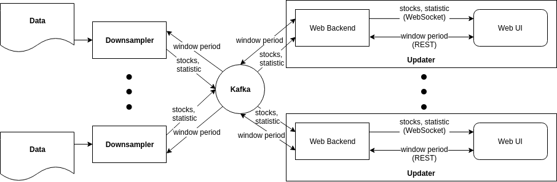

# Stock Exchange
System consist of 2 modules:
* Downsampler
* Updater
## Quick start
1. Prepare data
    1. Get data file like `EQY_US_ALL_TRADE_YYYYMMDD.gz` from [ftp.nyxdata.com](ftp://ftp.nyxdata.com/Historical%20Data%20Samples/Daily%20TAQ%20Sample%202018/)
    2. Unzip it's content
    3. Split stocks from file `EQY_US_ALL_TRADE_YYYYMMDD` with parser.py python script:
    ```bash
    python parser/parser.py /path_to_result_folder /path_to_data_file
    ```
2. Start downsampler
    ```bash
    DATASET_PATH=/path_to_stocks_folder KAFKA_FOLDER=/path_to_folder_for_streams_on_maprfs ./gradlew :downsampler:bootRun
    ```
3. Start updater
    ```bash
    KAFKA_FOLDER=/path_to_folder_for_streams_on_maprfs/ ./gradlew :updater:bootRun
    ```
4. Visit [localhost:8080](http://localhost:8080)
## Description of technologies

### Downsampler
For simulating working of Stock Exchange we are using data from nyxdata.com. At first we split data from one file to separate files for each stock. Then we start reading data for each stock, parse it, make rewinding if necessary, down sampling to specified period and count rates. After all operations on data are accepted they send to kafka. For this operations we use io.projectreactor.

### Updater
System provides REST for getting portfolios and managing window period. Stocks and statistic are providing over web socket. When user subscribes to web socket for updates, backend subscribes for proper kafka updates. When updates are received they sends to proper sessions over web socket.

